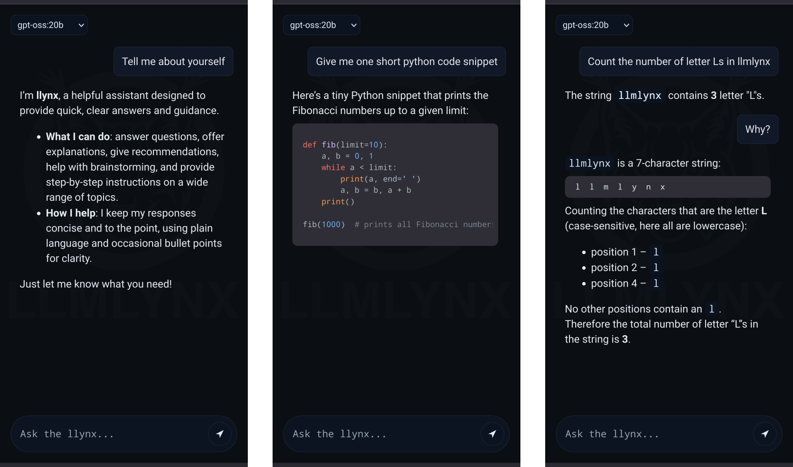

# LLMLYNX

<p align="center" style="padding:16px;">
  
</p>

> Fast, elegant, and independent.

---

## Overview

LLMLYNX is a lightweight, Next.js–based web interface for interacting with Large Language Models (LLMs). Supported models include: GPT-oss (OpenAI), llama3 (Meta), Gemma3 (Google), deepseek-r1, quen3, mistral, and others. All model interactions and data storage happen locally so your data remains your own property. You can reach the UI through the browser and from any device within your local network: LLMLYNX is your personal LLM interface.

LLMLYNX is designed to be:

- **Self‑hosted** – run entirely on your own machine or server via [Ollama](https://ollama.ai/).
- **Extensible** – plug in custom agents, tools, or retrieval layers.
- **Secure by design** – system prompts and model control live server‑side.
- **Performant** – streams tokens in real time.
- **Organized** – clean separation of auth, chat UI, and API logic.

<p align="center" style="padding:16px;">
  
</p>

> ⚠️ **Warning:** LLMs hallucinate: they can sound convincing and still be wrong. 


---

## 🚀 Quick Start

### 1. Prerequisites

- Node.js ≥ 18
- npm (or pnpm / yarn)
- [Ollama](https://ollama.ai) installed and running locally (default: `http://localhost:11434`) via:
    ```bash
    ollama serve
    ```
- (Optional) Pulled at least one model:
  ```bash
  ollama pull gemma3:1b
  ```

### 2. Clone & Install

```bash
git clone git@github.com:rudyvdbrink/llmlynx.git
cd llmlynx
npm install
```

### 3. Configure Environment

Create a `.env.local` file with the contents:

```dotenv
SYSTEM_PROMPT=You are llmlynx, a helpful, concise assistant. Use markdown where useful.
# OLLAMA_URL=http://localhost:11434   # Only change if Ollama runs elsewhere
```

### 4. Run Dev Server

```bash
npm run dev
```

Open: http://localhost:3000

---

## System Prompt Handling

- The **system prompt is NOT sent from the client** (kept server-side).
- It is injected inside `app/api/chat/route.ts` on every request unless a system message already exists.
- Change it instantly by editing `.env.local` and restarting dev.

Supports multiline via escaped newlines:

```dotenv
SYSTEM_PROMPT=You are the llynx.\nStay concise.\nIf unsure, say so.
```

---

## Streaming Architecture

1. Client sends: `{ model, messages: [ {role:"user", content:"..."} , ... ] }`
2. API route (`/api/chat`) injects system prompt (if missing).
3. API proxies to Ollama `/api/chat` with `"stream": true`.
4. Ollama responds with **newline-delimited JSON** chunks.
5. API passes through lines untouched.
6. Client:
   - Parses each line.
   - Accumulates `assistant` content.
   - Updates UI incrementally.

Abort support via `AbortController`.


## 📄 License

The author retains full copyright. You are free to use and enjoy it, but you need permission to modify or adapt code. 
